# Platform Architecture: rag-platform-qwen3

## 1. System Context Diagram

```mermaid
C4Context
  title System Context Diagram - rag-platform-qwen3

  Person(user, "End User", "Submits queries and uploads documents via API")
  Person(admin, "Platform Admin", "Manages infrastructure, monitors, configures")
  Person(evaluator, "Evaluation Engineer", "Runs benchmarks and reviews quality")

  System_Boundary(rag, "RAG Platform") {
    System(ragapi, "RAG API", "FastAPI-based API layer handling ingest and query")
  }

  System_Ext(qdrant, "Qdrant", "Vector database for embeddings")
  System_Ext(minio, "MinIO", "Object storage for documents and backups")
  System_Ext(openbao, "OpenBao", "Secrets management and PKI")
  System_Ext(vllm, "vLLM", "LLM inference server")
  System_Ext(langfuse, "Langfuse", "LLM observability and tracing")
  System_Ext(prom, "Prometheus + Grafana", "Metrics and dashboards")
  System_Ext(otel, "OpenTelemetry Collector", "Distributed tracing")
  System_Ext(gitea, "Gitea", "Source control and CI/CD")

  Rel(user, ragapi, "HTTP/HTTPS", "Ingest documents, submit queries")
  Rel(admin, ragapi, "HTTP/HTTPS", "Configure, monitor, manage")
  Rel(evaluator, ragapi, "HTTP/HTTPS", "Run evaluations")
  Rel(ragapi, qdrant, "gRPC", "Store and retrieve embeddings")
  Rel(ragapi, minio, "S3 API", "Store documents and snapshots")
  Rel(ragapi, openbao, "API", "Retrieve secrets and certificates")
  Rel(ragapi, vllm, "HTTP", "Generate embeddings and text")
  Rel(ragapi, langfuse, "HTTP", "Send traces and spans")
  Rel(ragapi, otel, "gRPC", "Export traces")
  Rel_P(prom, ragapi, "HTTP", "Scrape metrics")
```

## 2. Container Diagram

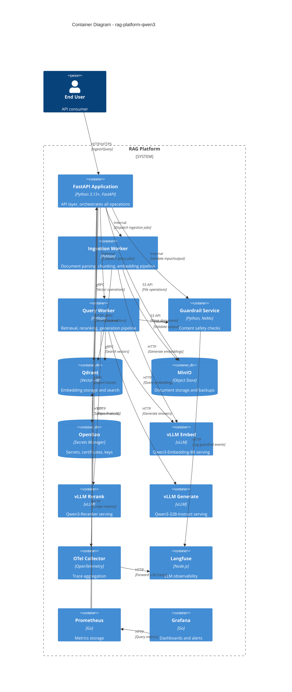

## 3. Component Diagram

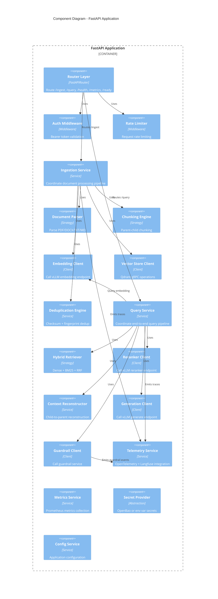

## 4. Deployment Diagram

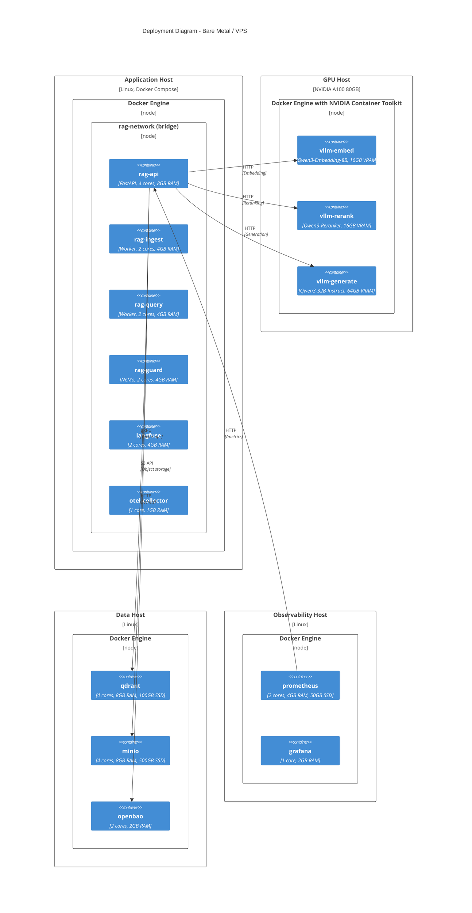

**Kubernetes alternative:** Each container becomes a Deployment/StatefulSet. Same networking via Services and Ingress.

## 5. Threat Model

### 5.1 STRIDE Analysis

| Category | Threat | Severity | Mitigation |
|----------|--------|----------|------------|
| **S**poofing | Attacker impersonates API client | High | mTLS, Bearer tokens |
| **S**poofing | Attacker impersonates service | High | mTLS certificate validation |
| **T**ampering | Document content modified in transit | Medium | TLS 1.3, checksums |
| **T**ampering | Embedding data modified at rest | Medium | Qdrant encryption, access control |
| **R**epudiation | User denies submitting harmful query | Medium | Audit logging, guardrail events |
| **I**nformation Disclosure | Secrets leaked via logs/env | High | OpenBao, no secrets in env |
| **I**nformation Disclosure | PII exposed in query results | High | PII guardrails, pre/post processing |
| **D**enial of Service | Resource exhaustion from large queries | Medium | Rate limiting, max tokens |
| **D**enial of Service | GPU OOM from batch overload | Medium | Request queuing, limits |
| **E**levation of Privilege | Tenant A access Tenant B documents | High | Collection isolation, RBAC |

### 5.2 Attack Surface

| Surface | Exposure | Protection |
|---------|----------|------------|
| API Endpoints | External (HTTPS) | Auth, rate limit, guardrails |
| Qdrant gRPC | Internal only | mTLS, network policy |
| MinIO S3 API | Internal only | mTLS, access keys |
| vLLM HTTP | Internal only | Network isolation |
| OpenBao API | Internal only | mTLS, token auth |

## 6. Data Flow Diagram

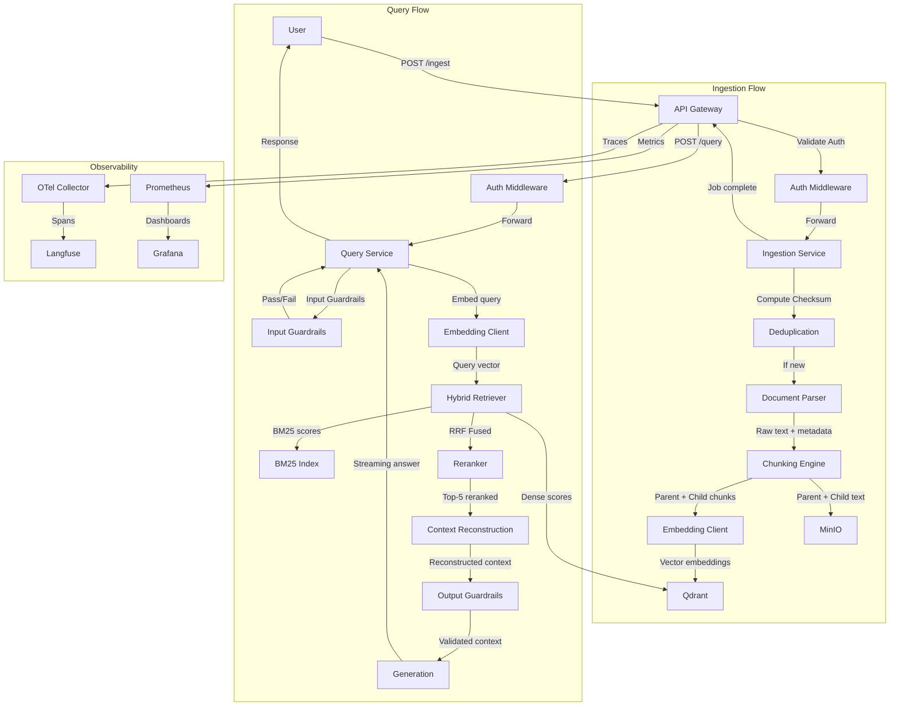

## 7. Trust Boundaries

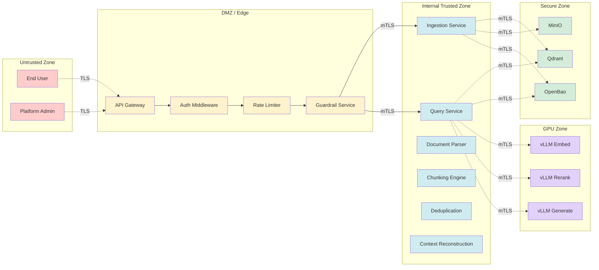

| Boundary | Trust Level | Access |
|----------|-------------|--------|
| External | None | Public internet (TLS) |
| DMZ | Low | Authenticated API traffic |
| Internal | Medium | Service-to-service (mTLS) |
| Secure | High | Critical data storage (mTLS + RBAC) |
| GPU | Medium | Model serving (network isolated) |

## 8. Retrieval Sequence Diagram

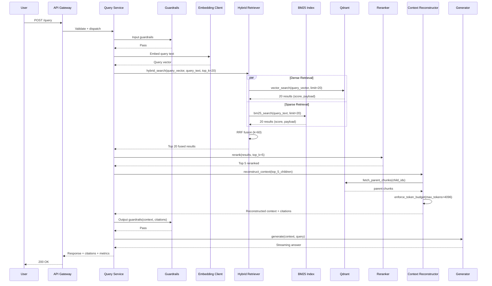

## 9. Guardrail Sequence Diagram

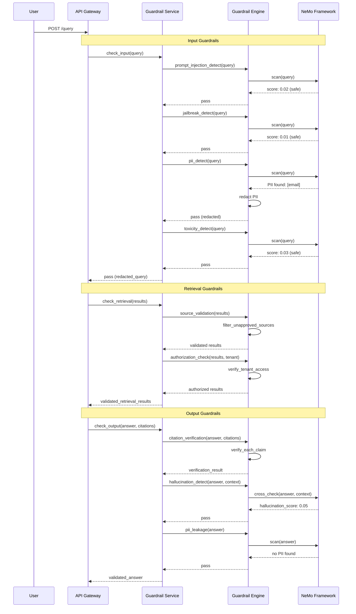

## 10. Evaluation Sequence Diagram

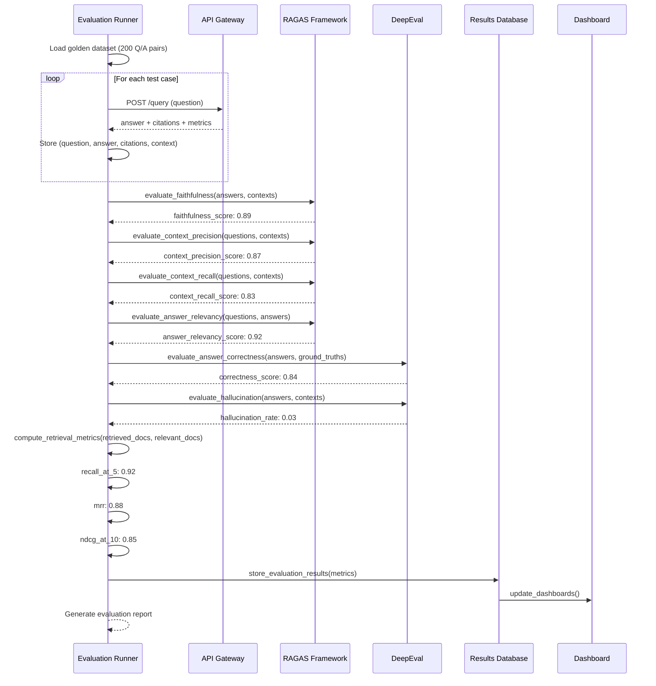

## 11. Observability Architecture

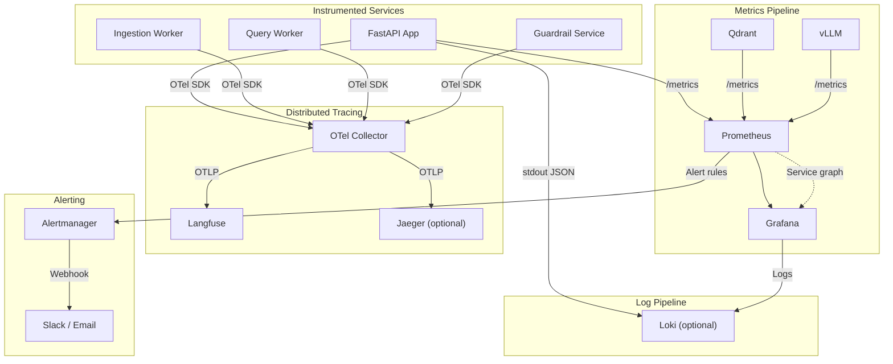

### 11.1 Key Metrics

| Metric Name | Type | Source | Description |
|-------------|------|--------|-------------|
| rag_query_total | Counter | FastAPI | Total queries received |
| rag_query_duration_ms | Histogram | FastAPI | End-to-end query latency |
| rag_retrieval_latency_ms | Histogram | Retrieval | Time to retrieve chunks |
| rag_reranking_latency_ms | Histogram | Reranking | Time to rerank results |
| rag_generation_latency_ms | Histogram | Generation | Time to generate answer |
| rag_guardrail_violations | Counter | Guardrails | Count of guardrail blocks |
| rag_tokens_input_total | Counter | Generation | Total input tokens |
| rag_tokens_output_total | Counter | Generation | Total output tokens |
| rag_embedding_latency_ms | Histogram | Embedding | Time to embed text |
| rag_retrieval_recall_at_5 | Gauge | Evaluation | Retrieval accuracy |
| qdrant_vectors_count | Gauge | Qdrant | Total vectors stored |
| vllm_gpu_memory_used | Gauge | vLLM | GPU memory utilization |

### 11.2 Langfuse Tracing

Every query creates a Langfuse trace:

```
Trace: query_{uuid}
  ├── Span: input_guardrails
  │   └── Event: guardrail_result (passed/blocked)
  ├── Span: query_embedding
  │   └── Attribute: model, latency
  ├── Span: hybrid_retrieval
  │   ├── Span: dense_search
  │   ├── Span: bm25_search
  │   └── Span: rrf_fusion
  ├── Span: reranking
  │   └── Attribute: model, input_k, output_k
  ├── Span: context_reconstruction
  │   └── Attribute: token_count, chunk_count
  ├── Span: output_guardrails
  │   └── Event: guardrail_result
  ├── Span: generation
  │   ├── Attribute: model, input_tokens, output_tokens
  │   └── Event: streaming_chunks
  └── Span: response
      └── Attribute: latency, status
```

## 12. Secrets Management Architecture

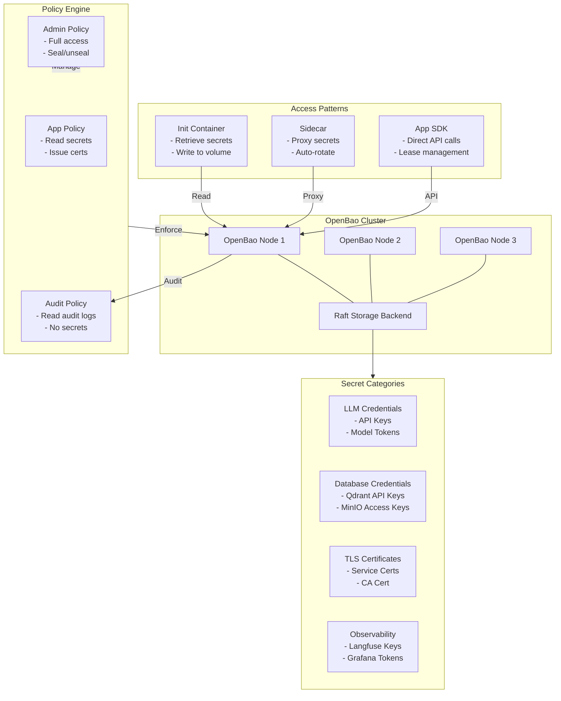

### 12.1 Secret Categories

| Category | Secrets | Rotation | Accessor |
|----------|---------|----------|----------|
| LLM Credentials | vLLM API keys, model tokens | 90 days | Generation service |
| Database Credentials | Qdrant key, MinIO key/secret | 90 days | API, workers |
| Storage Credentials | Backup encryption keys | 180 days | Backup jobs |
| API Keys | Application tokens | 30 days | API gateway |
| Observability Tokens | Langfuse key, Grafana API key | 90 days | Telemetry service |
| TLS Certificates | Service mTLS certs | 30 days | All services |

### 12.2 Bootstrap Process

1. Deploy OpenBao cluster (3 nodes, Raft backend)
2. Initialize OpenBao (generates unseal keys)
3. Distribute unseal keys to 3+ admins (Shamir secret sharing, threshold: 2)
4. Unseal OpenBao (requires 2 of 3 keys)
5. Configure auth methods (AppRole for services)
6. Write secrets via admin policy
7. Configure policies (app, admin, audit)
8. Enable PKI engine for mTLS certificates
9. Configure audit logging

## 13. Disaster Recovery Architecture

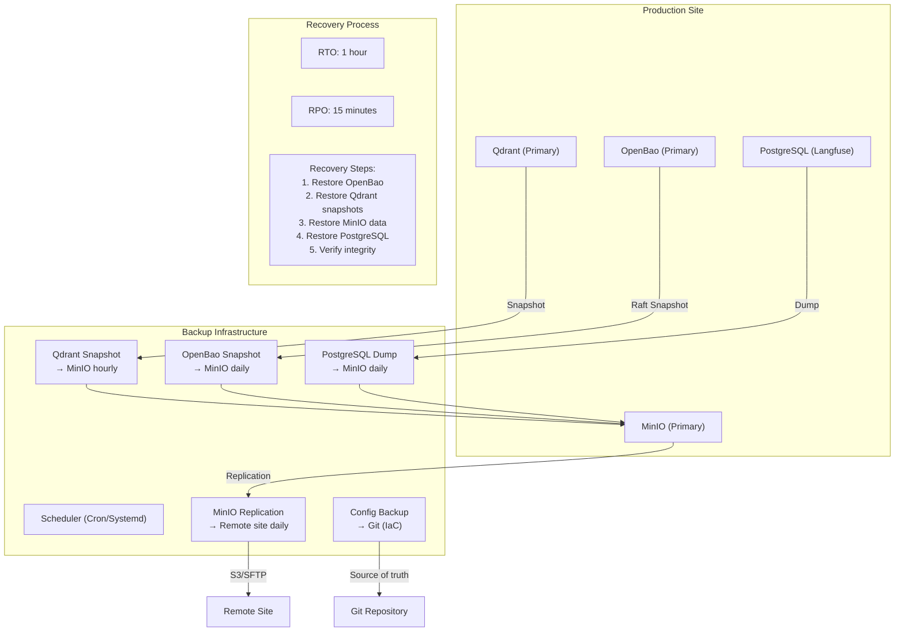

### 13.1 Backup Schedule

| Component | Type | Frequency | Retention | Destination |
|-----------|------|-----------|-----------|-------------|
| Qdrant | Snapshot | Hourly | 7 days | MinIO (local) |
| Qdrant | Snapshot | Daily | 30 days | MinIO (local) |
| MinIO | Replication | Continuous | 30 days | Remote site |
| OpenBao | Raft Snapshot | Daily | 30 days | MinIO + remote |
| PostgreSQL | pg_dump | Daily | 30 days | MinIO + remote |
| Application Config | Git commit | Every change | Indefinite | Gitea |

### 13.2 Recovery Procedures

| Scenario | Recovery Steps | Expected Time |
|----------|---------------|---------------|
| Qdrant data loss | Restore latest snapshot from MinIO | 15 minutes |
| Full data loss | Restore Qdrant → MinIO → OpenBao → DB | 45 minutes |
| Site failure | Provision new infra, restore from remote backups | 2 hours |
| OpenBao corruption | Restore Raft snapshot, re-unseal | 10 minutes |

---

## 14. LLM Provider Architecture

The platform supports multiple LLM backends through a provider abstraction layer.

```mermaid
flowchart TD
    subgraph API["Application Layer"]
        QS["Query Service"]
        GEN["Generation Client"]
    end

    subgraph Provider["Provider Abstraction"]
        IFACE["LLMProvider (ABC)"]
        FACTORY["Provider Factory"]
        CFG["ProviderConfig"]
    end

    subgraph Implementations["Provider Implementations"]
        VLLM["VLLMProvider<br/>vLLM self-hosted"]
        OAI["OpenAICompatibleProvider<br/>OpenAI-compatible API"]
        OR["OpenRouterProvider<br/>OpenRouter"]
    end

    subgraph Secrets["OpenBao Secrets"]
        VLLM_SEC["vllm/api_key<br/>vllm/api_base"]
        OAI_SEC["openai/api_key<br/>openai/api_base<br/>openai/model"]
        OR_SEC["openrouter/api_key<br/>openrouter/model"]
    end

    QS --> GEN
    GEN --> FACTORY
    FACTORY -->|"creates"| IFACE
    IFACE <|-- VLLM
    IFACE <|-- OAI
    IFACE <|-- OR
    VLLM -.->|"reads"| VLLM_SEC
    OAI -.->|"reads"| OAI_SEC
    OR -.->|"reads"| OR_SEC
    CFG --> FACTORY
```

### 14.1 Provider Selection

Provider is selected per-request based on configuration:

| Scenario | Recommended Provider | Configuration |
|----------|---------------------|---------------|
| Self-hosted GPU | vLLM | `provider: vllm` |
| External API (OpenAI, Anthropic) | OpenAI Compatible | `provider: openai_compat` |
| Multi-model routing | OpenRouter | `provider: openrouter` |

### 14.2 Provider Interface

```python
class LLMProvider(ABC):
    async def generate(prompt, system_prompt=None) -> GenerationResult: ...
    async def generate_stream(prompt, system_prompt=None) -> AsyncIterator[str]: ...
    async def health_check() -> bool: ...
```

### 14.3 Secret Schema

| Provider | OpenBao Path | Keys |
|----------|-------------|------|
| vLLM | `secret/llm/vllm` | `api_key`, `api_base` |
| OpenAI Compat | `secret/llm/openai` | `api_key`, `api_base`, `model` |
| OpenRouter | `secret/llm/openrouter` | `api_key`, `model` |

---

## 15. Technology Decision Records

### 15.1 Qdrant (Vector Database)

**Selected:** Qdrant

**Alternatives Considered:**
- Pinecone (proprietary SaaS - rejected: violates self-hosted requirement)
- Weaviate (self-hosted option, but higher resource usage)
- Milvus (more complex deployment, higher operational overhead)
- Chroma (lacks production features like replication, snapshots)

**Tradeoffs:**
- *Pro:* Written in Rust, excellent performance, native gRPC, built-in snapshots, payload filtering, quantization support
- *Pro:* Simple Docker deployment, no external dependencies, REST + gRPC APIs
- *Con:* Fewer integration recipes than Weaviate
- *Con:* Limited to ANN search (no keyword/BM25 natively - addressed by hybrid approach)

**Decision:** Qdrant for its performance, simplicity, and production features.

### 15.2 OpenBao (Secrets Management)

**Selected:** OpenBao

**Alternatives Considered:**
- HashiCorp Vault (recent license change to BSL - rejected: no longer fully open source)
- Infisical (SaaS-focused, less mature self-hosted story)
- SOPS + Age (simpler but lacks dynamic secrets, PKI, audit)

**Tradeoffs:**
- *Pro:* Fully open-source (Mozilla PL), Vault-compatible API, dynamic secrets, PKI engine, audit logging
- *Pro:* Active community fork after Vault's license change
- *Con:* Slightly fewer integrations than Vault's ecosystem
- *Con:* Newer project, smaller community

**Decision:** OpenBao for full open-source compliance with production-grade secrets management.

### 15.3 MinIO (Object Storage)

**Selected:** MinIO

**Alternatives Considered:**
- AWS S3 (proprietary SaaS - rejected)
- Ceph (more complex, overkill for this use case)
- SeaweedFS (less production-proven)

**Tradeoffs:**
- *Pro:* S3-compatible API, high performance, erasure coding, encryption, versioning, bucket replication
- *Pro:* Single binary deployment, console UI, low resource footprint
- *Con:* Not a POSIX filesystem (irrelevant for S3 API use case)

**Decision:** MinIO for S3 compatibility, performance, and self-hosted simplicity.

### 15.4 vLLM (Inference Runtime)

**Selected:** vLLM

**Alternatives Considered:**
- Ollama (simpler but less feature-rich for production: no continuous batching, no PagedAttention)
- TGI (Hugging Face - good but vLLM has better performance benchmarks)
- llama.cpp (CPU-focused, less GPU performance)
- TensorRT-LLM (NVIDIA - more complex deployment, vendor lock-in)

**Tradeoffs:**
- *Pro:* PagedAttention for near-perfect GPU memory utilization, continuous batching, OpenAI-compatible API, tensor parallelism
- *Pro:* Highest throughput for LLM inference in open-source
- *Con:* Requires NVIDIA GPU (no AMD ROCm support in stable)
- *Con:* More complex to configure than Ollama

**Decision:** vLLM for production-grade LLM serving with optimal GPU utilization.

### 15.5 LLM Provider Abstraction

**Selected:** Strategy Pattern with Factory

**Alternatives Considered:**
- Single provider hardcoded (rejected: not extensible)
- Configuration flags per provider (rejected: violates OCP)
- Plugin system (over-engineered for 3 providers at this stage)

**Tradeoffs:**
- *Pro:* Clean ABC interface allows adding new providers with zero changes to consumers
- *Pro:* Factory pattern handles provider selection based on config
- *Pro:* Each provider owns its auth, retry, and error handling
- *Con:* Slight indirection overhead (negligible vs network latency)
- *Con:* Need to maintain multiple provider code paths

**Decision:** ABC + Factory pattern for clean extensibility and testability.

### 15.6 Qwen3 Models

**Selected:** Qwen3-Embedding-8B, Qwen3-32B-Instruct, Qwen3-Reranker

**Alternatives Considered:**

*Embedding:*
- text-embedding-3-large (OpenAI - proprietary)
- BGE-M3 (BAAI - good multilingual, but smaller context window)
- E5-mistral-7b-instruct (good but 7B vs 8B)
- jina-embeddings-v3 (good but smaller)

*Generation:*
- Llama 3.1 70B (requires more GPU memory)
- Mixtral 8x7B (good but 8 active experts = ~48B equiv compute)
- DeepSeek V2 (good but Qwen3 has better instruction following on benchmarks)
- Qwen2.5 32B (previous gen, Qwen3 improves reasoning)

*Reranker:*
- BGE-Reranker-v2-m3 (good but smaller)
- Cohere Rerank (proprietary)
- jina-reranker-v2 (good but Qwen3 has stronger multilingual)

**Tradeoffs:**
- *Pro:* Unified model family (single provider, consistent API, consistent tokenizer)
- *Pro:* Qwen3-32B fits in 64GB VRAM with vLLM (single A100)
- *Pro:* Strong multilingual support, 128K context window for generation model
- *Con:* 32B requires significant GPU memory
- *Con:* Embedding model at 8B is heavier than alternatives (but higher quality)

**Decision:** Qwen3 family for unified model architecture, strong benchmarks, and single-provider consistency.

### 15.7 FastAPI (API Framework)

**Selected:** FastAPI

**Alternatives Considered:**
- Flask (sync, less performant, more boilerplate for validation)
- Django (heavy, more opinionated, built for full-stack web apps)
- Litestar (newer, less ecosystem maturity)

**Tradeoffs:**
- *Pro:* Async-native, automatic OpenAPI/Swagger generation, Pydantic validation, excellent performance
- *Pro:* Large ecosystem, production-proven at scale
- *Con:* Slightly more complex async patterns than Flask

**Decision:** FastAPI for async performance, automatic API documentation, and Pydantic integration.

### 15.8 NVIDIA NeMo Guardrails

**Selected:** NeMo Guardrails

**Alternatives Considered:**
- Guardrails AI (different philosophy - prompt-based guardrails, less structured)
- LLM Guard (lighter but fewer features)
- Custom implementation (more control but reinventing the wheel)

**Tradeoffs:**
- *Pro:* Structured Colang DSL for guardrail configuration, built-in prompt injection/jailbreak/PII detectors, action framework
- *Pro:* Active development, NVIDIA backing
- *Con:* Adds complexity to the stack
- *Con:* Colang DSL has learning curve

**Decision:** NeMo Guardrails for comprehensive, configurable content safety.

### 15.9 RAGAS + DeepEval (Evaluation)

**Selected:** RAGAS + DeepEval

**Alternatives Considered:**
- TruLens (good but RAGAS has broader RAG-specific metrics)
- Only RAGAS (DeepEval adds complementary metrics like hallucination rate)
- LangSmith (proprietary SaaS - rejected)

**Tradeoffs:**
- *Pro:* RAGAS has the most widely adopted RAG evaluation metrics (faithfulness, relevancy)
- *Pro:* DeepEval adds hallucination detection, answer correctness, structured testing
- *Pro:* Both are open-source, self-hostable
- *Con:* Overlap between the two frameworks
- *Con:* Requires an LLM-as-judge (uses Qwen3-32B)

**Decision:** Dual framework for comprehensive coverage - RAGAS for retrieval metrics, DeepEval for generation metrics.

### 15.10 Langfuse (Observability)

**Selected:** Langfuse

**Alternatives Considered:**
- LangSmith (proprietary SaaS - rejected)
- Weights & Biases Prompts (proprietary SaaS - rejected)
- MLflow Tracing (less mature, less LLM-specific)
- Custom OpenTelemetry (more work, fewer LLM-specific features)

**Tradeoffs:**
- *Pro:* LLM-specific tracing (token tracking, cost estimation, prompt/response logging), self-hostable, OpenTelemetry compatible
- *Pro:* Cost tracking per query, user session tracking
- *Con:* Requires PostgreSQL database
- *Con:* Adds ~200ms overhead per trace (configurable sampling)

**Decision:** Langfuse for purpose-built LLM observability with self-hosting support.

### 15.11 Gitea (Source Control + CI/CD)

**Selected:** Gitea + Gitea Actions

**Alternatives Considered:**
- GitHub (proprietary SaaS for Actions - rejected for self-hosted requirement)
- GitLab (heavier, more complex, higher resource usage)
- Drone CI (less ecosystem, fewer integrations)

**Tradeoffs:**
- *Pro:* Lightweight, Go binary, low resource usage, built-in CI/CD with Actions-compatible workflows
- *Pro:* Active development, large community
- *Con:* CI/CD less mature than GitLab or GitHub Actions
- *Con:* Mirror to GitHub required for external visibility

**Decision:** Gitea for lightweight, self-hosted source control with CI/CD.

### 15.12 uv (Python Package Manager)

**Selected:** uv

**Alternatives Considered:**
- pip + venv (slower, no lockfile, no dependency resolution standardization)
- Poetry (heavier, slower resolution, more opinionated)
- PDM (less ecosystem adoption)

**Tradeoffs:**
- *Pro:* 10-100x faster than pip, Rust-based, single binary, pip-compatible, lockfile support
- *Pro:* Primary Python package manager at the Python Software Foundation level
- *Con:* Newer, some edge cases in dependency resolution
- *Con:* Unfamiliar to developers used to pip

**Decision:** uv for speed, reliability, and industry momentum.

---

## 16. Resource Sizing

### 16.1 Minimum Production Configuration

| Component | CPU | RAM | Storage | GPU |
|-----------|-----|-----|---------|-----|
| FastAPI | 4 cores | 8 GB | 10 GB | - |
| Ingestion Worker | 2 cores | 4 GB | 10 GB | - |
| Query Worker | 2 cores | 4 GB | 10 GB | - |
| Guardrails | 2 cores | 4 GB | 5 GB | - |
| Qdrant | 4 cores | 8 GB | 100 GB SSD | - |
| MinIO | 4 cores | 8 GB | 500 GB SSD | - |
| OpenBao (×3) | 2 cores | 2 GB | 10 GB | - |
| vLLM Embed | 2 cores | 16 GB | 20 GB | 16 GB VRAM |
| vLLM Rerank | 2 cores | 16 GB | 20 GB | 16 GB VRAM |
| vLLM Generate | 8 cores | 128 GB | 50 GB | 64 GB VRAM |
| Langfuse | 2 cores | 4 GB | 10 GB | - |
| PostgreSQL | 2 cores | 4 GB | 20 GB | - |
| OTel Collector | 1 core | 1 GB | 5 GB | - |
| Prometheus | 2 cores | 4 GB | 50 GB | - |
| Grafana | 1 core | 2 GB | 5 GB | - |

**Total Minimum:** 4 hosts, ~220 GB RAM, ~7 TB storage, 1× A100 80GB GPU

### 16.2 Scaling Guidelines

| Component | Scale Signal | Action |
|-----------|-------------|--------|
| FastAPI | CPU > 70% | Add replicas |
| Qdrant | Query latency > 100ms | Add nodes, resize |
| vLLM Generate | Queue depth > 10 | Add GPU node |
| MinIO | Storage > 80% | Add storage |
| OpenBao | Request latency > 50ms | Add nodes |
